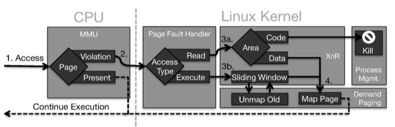

## 1.Background&Motivation

在现有的安全防护机制下，要实施基于内存漏洞的攻击，`memory disclosure`和`control flow hijack`是攻击的两个必要条件:

- `Memory Disclosure`是为了获得gadget地址，实施ROP攻击，ROP攻击是在无法实施code injection的前提下的一种解决方法；
- `Control flow hijack`就更straightforward些，transfer control flow to ROP chain。

但时，在ASLR以及一些fine-grained的randomisation的防护策略下，内存中代码细节均已被随机化，那么这就要求攻击者必须在运行时能够成功获得足够的内存中的代码来寻找有效的gadgets。2013年的Oakland上 Snow和David提出了Just in time code reuse[^JIT-code-reuse]的攻击框架，能够实现攻击过程中内存代码泄漏、gadget查找、代码重用等。

[^JIT-code-reuse]: K. Z. Snow, F. Monrose, L. Davi, A. Dmitrienko, C. Liebchen, and A. Sadeghi, “Just-In-Time Code Reuse: On the Effectiveness of Fine-Grained Address Space Layout Randomization,” in 2013 IEEE Symposium on Security and Privacy (SP), 2013, pp. 574–588.

基于以上现状，CCS2014上出现了文章 <You can run, but you cannot read:Preventing Disclosure Exploits in Executable Code>[^xnr] 一文。该文从代码泄漏的角度进行了防护：当代码在被执行期间，不允许对代码的读操作，从而能有效抵御JIT code reuse攻击，简称XnR。类似W^X（W⨁X)策略。
这一思路在无硬件支撑的条件下，通过软件MMU实现，

[^xnr]: M. Backes, T. Holz, B. Kollenda, P. Koppe, S. Nürnberger, and J. Pewny, “You Can Run but You Can’T Read: Preventing Disclosure Exploits in Executable Code,” in Proceedings of the 2014 ACM SIGSAC Conference on Computer and Communications Security, New York, NY, USA, 2014, pp. 1342–1353

## 2.方案细节

### 2.1基本思路

要实现XnR策略，在硬件不支持的情况下，可通过修改MMU中处理过程，实现软体MMU。
目前架构中：mmu可以检测到写，但是无法检测到读；读只能通过内存页的non-present实现；但是一旦non-present的话，代码也将无法运行。解决方法：修改page fault handler,在handler中区分page fault产生的原因，并决定是否继续正常执行，还是发现代码内存读取行为，中止执行。
具体的，在代码运行期间，仅允许极少的代码可读，文中的实验数据表明，采用3页的sliding windows是一个比较好的选择，即当前代码页面的相邻两页。是否可读性de实现方式是通过设置页面的present位实现，非法的读取将陷入中断，在中断中判断中断原因是缺页还是非法读。

### 2.2区分内存访问方式
实现的关键是在“缺页”中断时，准确区对内存的访问：是对数据的access还是对代码的读取。

> Each page fault is provided with additional information such as the address where the fault occurred and whether the ac- cess was generated during an instruction fetch. The latter is crucial information for our XnR solution: 
>> If the CPU was trying to execute an instruction in a memory page that was non-present, this constitutes a legitimate operation and we let the usual demand paging routine of the kernel fetch the page and mark it present. 

>> If, on the other hand, the access violation did not occur due to an instruction fetch, then the processor was trying to read memory as data. In this case, XnR has to distinguish whether the violating address is indeed inside a valid region of data or points to code. If the address lies inside a data region of the process, our page fault handler continues normally by mapping the missing page. Otherwise, the process tried to read from a code re- gion, which is illegal, as we assume executable code not to be readable. In this case we terminate the process with an error and prevent the attack.

#### page fault有三种情况：

- **Instruction Fetch**: The processor fetches a byte from mem- ory in order to decode and execute the instruction that it resembles. This constitutes a legal operation that takes place during code execution.
- **Load/Store of Data**: An instruction may accesses mem- ory that either contains code or data. If the load/store instruction targets data, this constitutes a legal oper- ation that is necessary to operate on data.
- **Load from Code**: However, if a load instruction targets code, this constitutes a programmatic disassembly that we consider illegal.

#### 区分的三种内存访问的逻辑：
1. 如果正在执行的是instruction fetch操作，则允许；否则2
2. 尝试read memory as data，则还进一步需要区分读的是代码还是数据；如果是数据，则继续；如果是代码，则中止。

### 2.3在Linux上的检测流程

Flow diagram of how the CPU, MMU and parts of the Linux kernel interact in order to implement XnR.

### 2.4 Sliding Windows

为了在安全性和performance中做个balance，作者引入了sliding windows机制。即除了将正在运行的code page设为present之外，还将最近访问的n个code page设为present。n为security和performance的parameter，也就是sliding windows的窗口大小。

- 对于n>1，则意味着n个页面不受XnR机制保护，如果这些页面内存在memory disclosure，则攻击者就有可能获得这些页面内存，并在这些页面内寻找gadgets，并组织ROP。然而，最近访问的页面（窗口内的页面）是由程序的控制流决定，每次都会是相同的code pages，或者由于runs the risk of picking a path, which was not executed this time，从而crashes the program.
- 当n为总的页面数时，所有的代码页面都在窗口内，从而相当于没有XnR机制。

## 3 Evaluation

### 3.1 Effectiveness

作者从对内存的不同访问方式的来衡量方法的有效性：exp（代码读，且不执行）检测的有效性，正常代码的有效性（在Linux和win上时正常的code read的检测准确性）

**exploitation detection**

- manually weakened the netcat tool to plant a memory disclosure vulnerability。
- 尝试泄漏时，程序被中止。需要注意的是：作者是通过分析，说抵御抵JIT－ROP，虽然很容易理解也很显然的问题，但作者毕竟没有实际验证。

### 3.2Performance

见文章。

## 4. 其他

1. 与此文相关的一文就是，无需内存泄漏，通过side channel实现攻击。Information Leaks Without Memory Disclosures: Remote Side Channel Attacks on Diversified Code[^infoleak-without-memory-disclosure]
2. 看到本文的标题时，眼前一亮——有意思！看完摘要，一切了然于心。idea不算奇葩，出发点很practical，实现上确实也不复杂（文章也没写长），总的来说很赞！但是这样的改动／改进，对系统其它方面有什么影响，这个个人还不确定，持有疑虑态度。

---------
自己做了个slides，有兴趣可以看看：

- slideshare上访问链接：[http://www.slideshare.net/ch0psticks/xnr](http://www.slideshare.net/ch0psticks/xnr)
- 百度网盘链接：[http://pan.baidu.com/s/1sjtHFDr](http://pan.baidu.com/s/1sjtHFDr)
	

[^infoleak-without-memory-disclosure]: J. Seibert, H. Okkhravi, and E. Söderström, “Information Leaks Without Memory Disclosures: Remote Side Channel Attacks on Diversified Code,” in Proceedings of the 2014 ACM SIGSAC Conference on Computer and Communications Security, New York, NY, USA, 2014, pp. 54–65.

